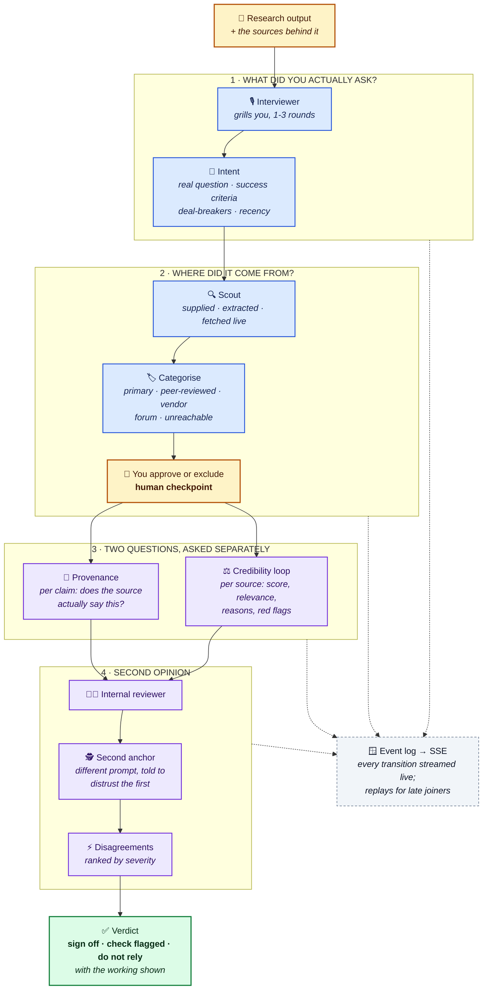
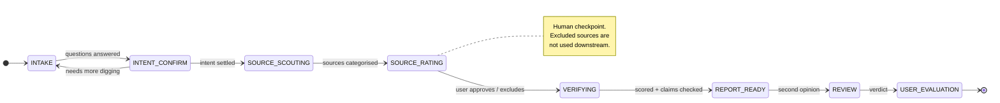
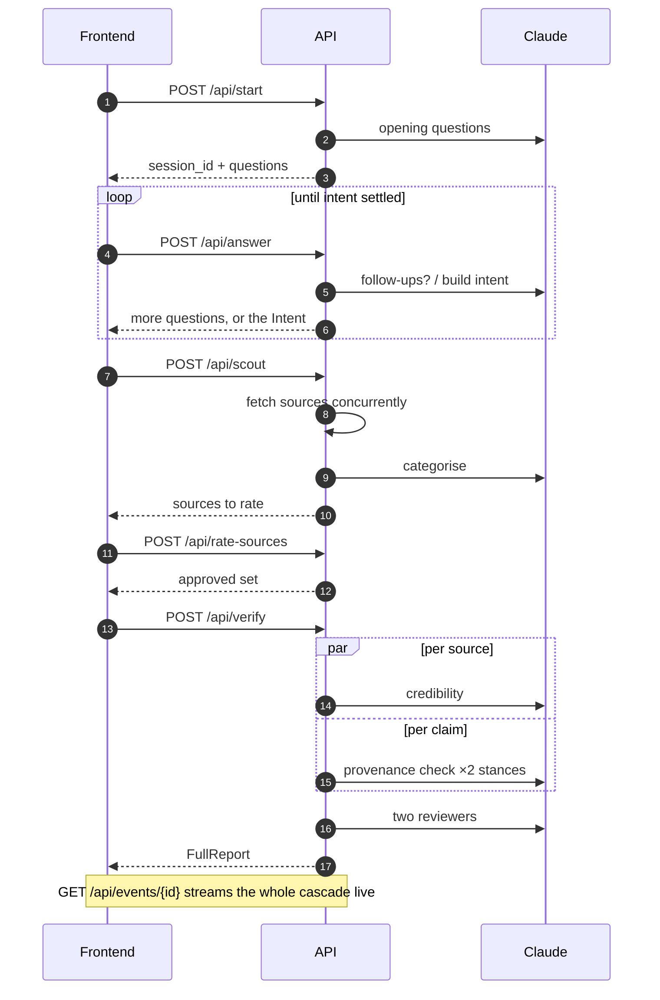

# Architecture — Glassbox

**Track:** `verify` — Trust, but check.
**The test we design against:** *would you sign off on the result without re-reading every line?*

Merges the original verification pipeline with [CONCEPT.md](CONCEPT.md). Where the two
diverged, the resolution is recorded in §Resolved divergences.

## The idea in one line

Given a piece of research and the sources behind it, tell the user how much they should
trust it — and show the working at every step.

## Two questions, not one

The insight that shaped the build: **a credible source proves nothing if the research
misused it.**

Scoring sources answers *"is this evidence any good?"* It does not answer *"did the research
report it honestly?"* Overreach — generalising one company's result to "companies
generally", one year to "consistently" — is the most common real failure of LLM research,
and source scoring is blind to it.

So Glassbox runs both checks:

| | Question | Module |
|---|---|---|
| **Credibility** | Are the sources any good? | `scoring.py` |
| **Provenance** | Did the research use them honestly? | `claims.py` |

## The cascade



Every transition is written to a per-session event log, which both drives the live UI and
serves as the audit trail after the fact.

## The state machine



## API surface



## Components

### `survey.py` — the interviewer
Interactive. Asks 3–4 sharp, research-specific questions, may follow up (capped at 3 rounds),
then produces an `Intent`: the real question restated, success criteria, deal-breakers,
domain, recency requirement. Everything downstream is judged against this — a rigorous source
answering a *different* question is credible but irrelevant, and the report has to be able to
say so.

### `sources.py` — the scout
Three acquisition routes, all live:
- **supplied** — handed over with the input
- **extracted** — pulled out of the research text itself (footnotes, attributions, bare URLs)
- **fetched** — retrieved live over HTTP, concurrent, capped at 8, failures never raise

Then categorised: peer-reviewed, primary, reputable media, analyst, vendor marketing, press
release, blog, forum, encyclopaedia, unknown, unreachable. Unambiguous domains are decided
**deterministically before** the model is consulted (arxiv/doi -> peer-reviewed,
`.gov`/europa.eu/destatis -> primary, reddit/HN -> forum) — cheaper and more defensible than
asking a model.

### `scoring.py` — the credibility loop
One assessment per source: score 0–100, confidence, concrete reasons, red flags, and
**relevance to intent scored separately from credibility**.

The aggregate is computed **in Python, not by the model**:

```
weight_i  = max(relevance_to_intent_i, 5)
base      = sum(score_i * weight_i) / sum(weight_i)
penalty   = share of sources unreachable or uncategorised
overall   = clamp(base - penalty * 40, 0, 100)
```

Weighting by relevance is the point: a weak source answering your actual question should hurt
far more than a weak source that is off-topic. Verified — the same weak source scores 27 when
relevant, 83 when not. Verdict thresholds: >=75 `sign_off`, >=45 `check_flagged`, else
`do_not_rely`.

### `claims.py` — provenance
Extracts up to ~12 load-bearing claims (statistics, causal statements, attributions), then
checks each against the actual fetched source content:

- `SUPPORTED` — a source states this
- `PARTIAL` — related but weaker or narrower than the claim
- `UNSUPPORTED` — nothing backs it
- `CONTRADICTED` — a source says the opposite

Claims the model introduced with nothing behind them are marked `MODEL` provenance rather
than passed off as fact.

Two checking stances share the module: `default`, and `adversarial` — which assumes the first
reader was too generous, refuses "merely discusses the topic" as support, and downgrades
SUPPORTED to PARTIAL wherever a claim generalises beyond its source's scope.

### `review.py` — the second opinion
An internal adversarial reviewer, plus a **second anchor** with a deliberately different
system prompt, framed as an outside auditor told to distrust the first reviewer's leniency.
The per-claim re-check runs under the `adversarial` stance, so the two passes are genuinely
different readings rather than two samples of one prompt.

Disagreements are computed deterministically and ranked by severity — supported-vs-
contradicted outranks supported-vs-partial. Degrades gracefully: if the second anchor fails,
you still get the internal verdict.

### `events.py` — the glass
Explicit state machine, per-session event log, SSE stream. `subscribe()` replays everything
logged so far before streaming live, so a browser connecting late still renders the whole
cascade. Multiple simultaneous subscribers supported.

## Stack

Python 3.14 · FastAPI · Anthropic SDK · httpx · pydantic v2 · `uv`.

Per-stage model env vars (`MODEL_SURVEY`, `MODEL_EXTRACT`, `MODEL_SCORE`, `MODEL_AGGREGATE`)
— the scorer runs once per source, so it is the one that adds up on a large bibliography.
System prompts are long and stable so prompt caching actually bites.

Frontend consumes the JSON API and the SSE stream. CORS is wide open.

## Resolved divergences from CONCEPT.md

| Concept proposed | Built | Why |
|---|---|---|
| Next.js monolith | **Python / FastAPI** | The backend already existed and worked; a stack switch mid-day would have cost everything |
| System *conducts* the research | System *audits* research you bring | Smaller, sharper, and closer to the actual track question |
| 11 states | 8 | States 9–11 are the delayed outcome loop — vision, not MVP |

**Deliberately not built** (CONCEPT.md §10 calls these vision): delayed outcome loop, trust
ledger, cross-job learning. These are the honest "what's next".

## What is real vs. stubbed

*Kept current for the pitch — the organisers ask for exactly this.*

**Real, verified offline:** the state machine; event log with replay and multi-subscriber SSE;
the scoring formula and its relevance weighting; provenance counting; disagreement severity
ranking; all three source-acquisition routes; full API wiring.

**Stubbed / simplified:** no retry or backoff on any call — a failure is recorded and the
pipeline continues; HTML-to-text stripping is crude, so nav and footer boilerplate stays in
excerpts; datedness relies on the model reading a date out of the excerpt rather than parsed
metadata; sessions are in memory and do not survive a restart.

## Running it

```bash
cd backend
cp .env.example .env      # add your ANTHROPIC_API_KEY
./run.sh                  # http://localhost:8000  (docs at /docs)

uv run python scripts/smoke.py   # end-to-end against examples/demo_case.json
```

`examples/demo_case.json` is deliberately rigged: a dead link, a vendor selling the thing it
is cited for, a reddit thread, and one genuine primary source — plus a research text that
claims "35% revenue rise" and "broad consensus" its own sources do not support.
