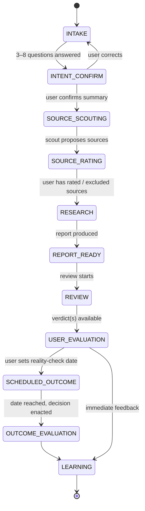

# Glassbox — Concept

> Working title. "Glassbox" as the counter-term to black box — the name is Roman's call, this is just a placeholder.

**Hackathon track:** Trust, but check (verify)
**Track prompt:** *Would you sign off on the result without re-reading every line?*
**Date:** 2026-08-12

---

## 1. Hypothesis

LLM output is, at first, a black box to the person using it. The more they understand and
**see visualized what is happening right now** — which sources get picked, how a
recommendation is formed, where a model is unsure — the more warranted their trust
becomes. Trust here is not asserted; it is **made checkable at every transition** and, in
the end, held against reality.

## 2. Example scenario (concrete) and abstraction

**Concrete:** A person is considering moving to a different city and consults an LLM about it.

**Abstract:** The workflow is a generic **research-and-decision assistant with a verification
cascade**. The move is just the first instance. Any consequential research decision fits the
same pattern: changing jobs, choosing a vendor, an investment, a course of study, a company
picking a location. That is why every domain-specific part (the interview questions, the
source candidates, the evaluation rubric) is kept **data-driven** rather than hard-coded.

## 3. Core principles

1. **Every step is visible.** The workflow is an explicit state machine; the UI shows live
   which state you are in, who is acting (human or agent), and what the agent is doing.
2. **Human-in-the-loop at defined checkpoints.** The user confirms the research goal, rates
   the sources before research, evaluates the output afterwards — and later closes the
   reality check.
3. **Provenance before assertion.** Every claim in the report carries a trail back to its
   source. Anything the model introduced on its own is marked as such, not disguised as fact.
4. **A second opinion is built in.** The report is critically reviewed by a second agent;
   optionally also by a provider-independent model as an external anchor.
5. **Reality beats plausibility.** The real validation comes from delayed outcome feedback,
   not from the system's own self-assessment.

## 4. The workflow as a state machine



### States in detail

| # | State | Who acts | Input | Output | What is visualized |
|---|-------|----------|-------|--------|--------------------|
| 1 | `INTAKE` | Interviewer agent + user | raw request | 3–8 answered questions | questions one by one, progress |
| 2 | `INTENT_CONFIRM` | System + user | answers | confirmed intent profile | summary to proofread, correct button |
| 3 | `SOURCE_SCOUTING` | Scout agent | intent profile | list of source candidates with rationale | live log "finding sources …", candidates appear one by one |
| 4 | `SOURCE_RATING` | User | source candidates | approve / exclude / trust rating per source | source cards, slider/traffic-light, exclusion reason |
| 5 | `RESEARCH` | Researcher agent | approved sources + intent | report with claims + provenance | live progress, which source is being read |
| 6 | `REPORT_READY` | System | report | structured report | report with provenance markers per claim |
| 7 | `REVIEW` | Reviewer agent (+ optional second model) | report | verdict, uncertainty flags, disagreement list | confidence heatmap, disagreement view |
| 8 | `USER_EVALUATION` | User | report + verdict | rating along a fixed rubric | rubric form, user vs. agent judgment compared |
| 9 | `SCHEDULED_OUTCOME` | System | user-defined date | reminder | timeline with the reality check set |
| 10 | `OUTCOME_EVALUATION` | User | real result | actual rating of the recommendation | expected (recommendation) vs. actual (reality) |
| 11 | `LEARNING` | Learner agent/job | all signals | updated trust profiles | trust ledger over time |

## 5. Agent roles

Each agent has a fixed input/output schema (JSON) so transitions stay machine-checkable.

- **Interviewer** — derives 3–8 goal-sharpening questions from the raw request (adaptive, not
  static). Purpose: sharpen the research goal before resources are spent.
- **Scout** — researches *which* sources make sense for this job, justifies each one, and
  estimates an initial trust indication. Does not research the content, only the source
  landscape.
- **Researcher** — performs the actual research exclusively on the sources the user approved
  and produces a report in which every claim carries its provenance.
- **Reviewer** — reviews the report adversarially: where does a recommendation rest on a weak
  or excluded source? Where is a conclusion unsupported? Explicitly marks what it **cannot**
  verify.
- **Second Anchor (optional)** — the same review by an internal or provider-independent
  model. Shows agreement and disagreement with the first reviewer. Deliberately
  model-agnostic so no vendor lock-in arises.
- **Learner** — aggregates immediate and outcome feedback into durable trust profiles
  (sources, inference patterns, recommendation types).

## 6. The learning loop — two levels

**Level 1 — Immediate (plausibility).** Right after the review, the user rates the output
along a fixed rubric. This measures whether the output was *convincing and traceable*.

**Level 2 — Delayed (reality).** At the point in time the user sets themselves — after the
decision has actually been enacted — the user rates the **real result**. Only this measures
whether the recommendation was *good*. This level is the actual heart of the system: it lets
the question "should I have been allowed to sign off without re-reading?" be answered after
the fact, against ground truth.

From both levels the system learns three things:
- **Which sources** turned out to be trustworthy (rating beforehand vs. usefulness afterwards).
- **Which inferences** made sense (reasoning patterns that led to good outcomes).
- **Which recommendations** were good — and via the delayed level: **why**.

### Evaluation rubric (proposal, configurable)

Per recommendation: traceability · source coverage · usefulness · surprise value.
Per source in hindsight: was it relevant? · was it trustworthy? · would I use it again?
Outcome level: result as expected? · which recommendation was decisive? · which one missed,
and why?

## 7. Data model (core entities)

```
ResearchJob        id, title, domain, status(state), created_at
IntentProfile      job_id, questions[], answers[], confirmed_summary
Source             job_id, url/ref, type, scout_rationale,
                   scout_trust, user_rating, excluded(bool), exclusion_reason
Claim              report_id, text, source_ids[], provenance(enum: source|model|user),
                   confidence
ResearchReport     job_id, claims[], recommendations[], created_at
ReviewVerdict      report_id, reviewer(enum: internal|external), score,
                   uncertainty_flags[], disagreements[]
UserEvaluation     report_id, rubric_scores{}, free_text, created_at
OutcomeRecord      job_id, due_date, enacted(bool), actual_rating{},
                   decisive_recommendation, misses[], captured_at
TrustProfile       key(source|pattern|recommendation_type), score,
                   evidence_count, last_updated
EventLog           job_id, state_from, state_to, actor, payload, timestamp
```

The `EventLog` is doubly valuable: it feeds the live visualization **and** is the audit trail
that makes the whole cascade traceable after the fact.

## 8. Architecture

### Backend

- **State machine** as the centerpiece. A job is always in exactly one state; transitions are
  explicit and recorded in the `EventLog`. No agent starts without a defined predecessor state.
- **Agents as pure functions** with a strict JSON schema for input and output (enforced via
  structured output). This makes each agent individually testable and transitions validatable.
- **Model abstraction** `callModel(provider, role, input)`. Default Anthropic; the Second
  Anchor can be a different provider. Switching providers must never break the workflow.
- **Live channel** via Server-Sent Events: while an agent runs, the backend streams progress
  events to the frontend (which source is being read, which claim is forming).
- **Persistence** kept lean (SQLite is enough for the hackathon). What matters is schema
  fidelity, not scale.
- **Scheduler** for the delayed outcome check: a simple due-date table that generates a
  reminder when the date arrives.

### Frontend

- **State-driven UI.** A cascade/stepper view shows all eleven states; the active one is
  highlighted, completed ones are expandable (you can inspect each step after the fact).
- **A specialized view per state** (see the "What is visualized" column in section 4).
- **Signature visualizations** that open the black box:
  - *Live cascade* — animated flow between the agents, the active agent pulses.
  - *Provenance graph* — every claim in the report links to its sources, color-coded by user
    trust; model-introduced claims without a source stand out.
  - *Confidence heatmap* — report sections tinted by reviewer certainty.
  - *Disagreement view* — spots where the first and second model contradict each other, side
    by side.
  - *Trust ledger* — timeline of how trust in sources and patterns evolves across multiple jobs.

## 9. Tech stack (hackathon-ready, recommended)

A single **Next.js project (TypeScript, App Router)**: React for the visualization, API routes
for the agent cascade, SSE for live updates, SQLite (better-sqlite3 or Prisma) for
persistence, Anthropic TS SDK behind the model abstraction. One repo, one process, quick to
demo — ideal for a solo build with Claude Code.

If Python agents are preferred: FastAPI backend + Vite/React frontend. Costs a second process,
gains nothing decisive for the hackathon scope.

## 10. Hackathon scope vs. vision

**MVP for the demo (build):**
- Full state machine covering states 1–8 (intake through immediate evaluation).
- All agents in a simple form, real source research (web search as a tool).
- Live cascade + provenance graph + disagreement view as the visible "black-box openers".
- Optional Second Anchor via toggle.

**Vision (hint at, don't build):**
- Delayed outcome loop (states 9–11) — show conceptually, demonstrate with a prepared sample
  dataset instead of waiting live.
- Trust ledger across many jobs.
- Transfer to further domains via swappable question/source/rubric packs.

## 11. Demo narrative (60–90 seconds)

1. "I'm considering moving to X." → the interviewer asks five questions, I answer them.
2. I proofread the summary and correct one point — a visible checkpoint.
3. The scout proposes seven sources. I exclude two (a tabloid site, an outdated forum) and
   mark two as especially trustworthy.
4. The researcher works **only** on my approved sources — visibly live, which one it is
   reading.
5. The report appears; every recommendation shows via the provenance graph what it rests on.
6. The reviewer flags one recommendation as "not sufficiently supported"; the second model
   disagrees with the first at one spot — the disagreement view shows exactly where.
7. I rate along the rubric — and set a reality check for "in 3 months, after the move".
8. Closing line: *"I'd sign off on this — not because the model says so, but because I saw at
   every step what it rests on. And in three months the system checks itself against reality."*

---

*Open items for Roman: name choice · stack decision (Next.js monolith recommended) · which
domain beyond the move to show as a second instance.*
