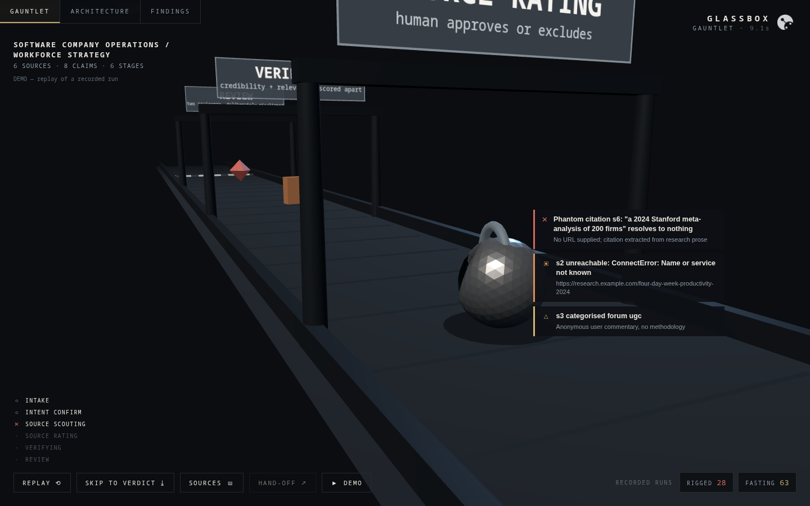
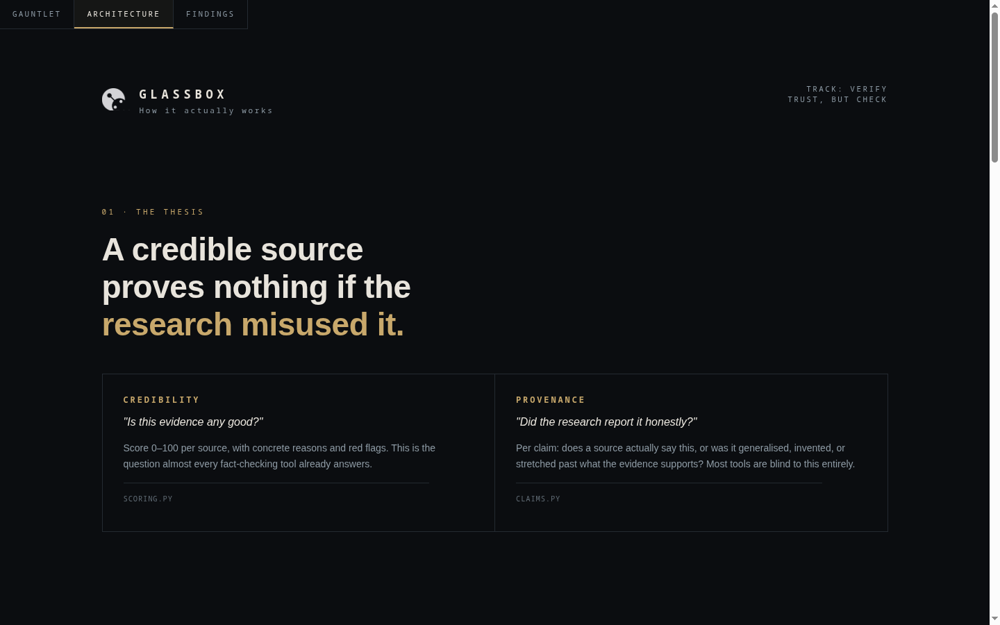
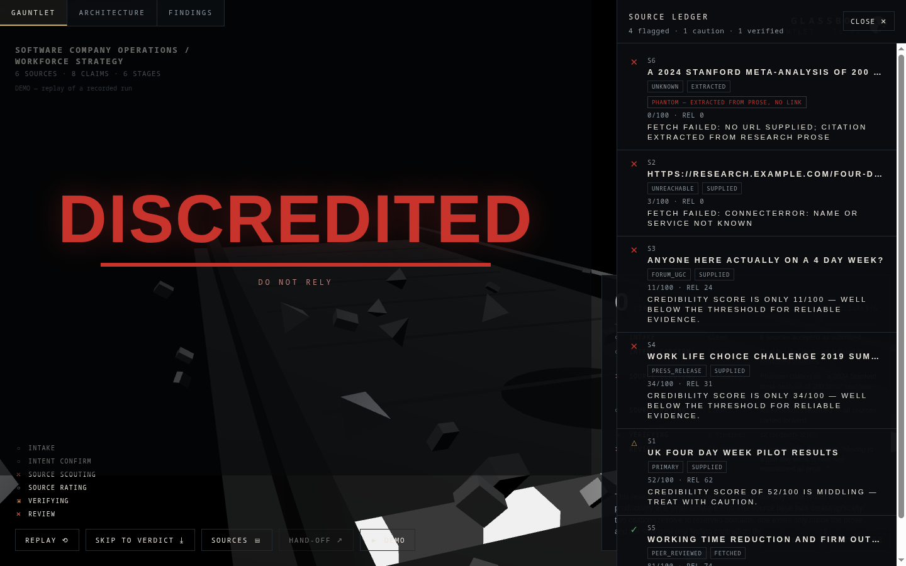

<div align="center">


# Glassbox

### 🏆 &nbsp;Winner — Claude Impact Lab, Munich &nbsp;·&nbsp; 12 August 2026

[](https://luma.com/claudecommunity)
[](#)
[](#)

**Would you sign off on this research without re-reading every line?**

Glassbox takes a piece of AI-generated research and the sources behind it, and tells you how
much of it you can actually trust — showing its working at every step.


[**Architecture**](ARCHITECTURE.md) · [**Frontend brief**](FRONTEND_BRIEF.md) ·
[**Pitch**](PITCH.md) · [**Recorded runs**](examples/) · [**What's still broken**](#what-is-still-wrong)

<br>



<sub>Research walks a gauntlet. Every gate is a verification stage; every card is a real finding.</sub>

</div>

---

<div align="center">

|  | Rigged research | Genuine research |
|---|---|---|
| **Verdict** | 🔴 `do_not_rely` | 🟡 `check_flagged` |
| **Score** | **28**/100 | **63**/100 |
| **Invented claims** | 4 | 0 |
| **Unsupported claims** | 4 | 0 |
| **Sources fetched** | 6 | 9 |

**Same pipeline. Different bands.** That separation is the entire point.

</div>

---

## The problem

The room at the Claude Conversations evening put it plainly: *the output looks right, and
checking it properly takes longer than making it did.*

Verification tools score sources. That answers **"is this evidence any good?"** — and stops
there. It never asks whether the research *used* that evidence honestly: whether one company's
result quietly became "companies generally", or a single year became "consistently".

A perfect source proves nothing if the text misrepresented it.

## The idea

Glassbox asks both questions, and keeps them separate.

|  | Question | How |
|---|---|---|
| **Credibility** | Are the sources any good? | Per-source score, weighted by relevance to what you actually asked |
| **Provenance** | Did the research use them honestly? | Every claim checked against the source's real fetched content |

Then it does the thing a verdict alone can't: **it hands you a prompt to redo the research
properly.**

## How it works

```
INTAKE ─► INTENT ─► SCOUT ─► [ you rate sources ] ─► VERIFY ─► REVIEW ×2 ─► HAND-OFF
```

1. **It grills you first.** Three to nine questions about what you were actually trying to find
   out, and what would make the answer wrong. A rigorous source answering the wrong question is
   credible but useless — the report has to be able to say that.
2. **It finds sources three ways** — supplied with the input, extracted from the research prose
   itself, and fetched live over HTTP.
3. **You approve or exclude them.** A human checkpoint; excluded sources are not used anywhere
   downstream.
4. **It scores each source** — credibility and relevance separately, with concrete reasons and
   red flags attached, never a bare number.
5. **It checks every claim** against what its sources actually say: `supported`, `partial`,
   `unsupported`, `contradicted`. Claims the model invented are marked as invented.
6. **It gets a second opinion** from a reviewer given a deliberately different prompt and told
   to distrust the first one's leniency, then surfaces exactly where they disagree.
7. **It streams the whole thing live** over SSE, so nothing happens in a black box.
8. **It hands you a way out** — a paste-ready research prompt: your question restated, your
   success criteria as requirements, your deal-breakers as prohibitions, the sources not to
   lean on again, and the claims that still need primary evidence.

See [ARCHITECTURE.md](ARCHITECTURE.md) for the diagrams and the scoring formula — or open
`architecture.html` in the app, which explains the same thing in the project's own language:

<div align="center">



</div>

## It works — two recorded runs

Both are real, unedited output. The JSON payloads are committed, so the demo replays them
without a backend.

### 🔴 Rigged research — **28/100 · `do_not_rely`**

A four-day-week brief built to fail.

```
[s1]  62  industry_analyst  Autonomy — the advocacy org that ran the trial it reports on
[s2]   3  unreachable       .example.com — "almost certainly a fabricated URL"
[s3]   8  forum_ugc         Reddit — the fetched excerpt was literally the word "Reddit"
[s4]  52  primary           Destatis — "a navigation page, no substantive data"
[s5]   3  unknown           a 2019 Microsoft Japan press release, cited with no link
[s6]   2  unreachable       a second fabricated domain

claims: 0 supported · 2 partial · 4 unsupported · 4 model-invented
```

The text claims a *"35% revenue rise"*. The real figure in the source it cites is ~1.4%. Four
of its six assertions trace to nothing at all, and Glassbox labels them `model-invented` rather
than letting them pass as fact.
→ [`examples/rigged_run.txt`](examples/rigged_run.txt) ·
[hand-off prompt](examples/handoff_prompt_rigged.txt)

### 🟡 Genuine research — **63/100 · `check_flagged`**

Real agent output on intermittent fasting: nine PubMed/PMC sources, correctly tiered
isocaloric vs. ad-libitum trials, honestly hedged.

```
claims: 4 supported · 6 partial · 0 unsupported · 0 model-invented
ledger: 3 verified · 5 caution · 1 flagged
scores: 78 72 72 68 68 62 62 62 · 18 (the one that 403'd)
```

Nothing invented, nothing unsupported. The single flagged source is Oxford Academic, which
returned `403` to our fetcher — as did Science.
→ [`examples/fasting_run.txt`](examples/fasting_run.txt) ·
[hand-off prompt](examples/handoff_prompt_fasting.txt)

### The verdict, and the receipts behind it

<div align="center">



<sub>The headline verdict never appears without the ledger that produced it — every source, its
score, its category, and why it landed in that band. Symbols as well as colour, so the bands
survive colour-blindness and greyscale.</sub>

</div>

## What the hand-off produces

Verbatim from the fasting run — it caught a study-design error, not just a broken link:

> *"Do not cite a study comparing early versus late eating windows (such as the ChronoFast 2025
> crossover trial) as evidence for or against TRE versus unrestricted eating, **since those are
> within-TRE comparisons**."*

> *"Its literature search **ended April 2022**, missing all the 2023–2025 trials the intent
> requires. Find a more recent systematic review."*

## Run it

```bash
git clone https://github.com/Mulaydm10/claude-impact-lab-munich.git glassbox
cd glassbox/backend
cp .env.example .env          # add your ANTHROPIC_API_KEY
./run.sh                      # http://localhost:8000 — API docs at /docs
```

End-to-end against a fixture (takes 4–9 minutes — it fetches every source and checks every
claim twice):

```bash
uv run python scripts/smoke.py --case intermittent_fasting_case
uv run python scripts/smoke.py --interactive   # answer the grilling yourself
```

The frontend is static, and **must be served from the repo root** so it can reach the recorded
runs:

```bash
cd glassbox && python3 -m http.server 8090
# → http://localhost:8090/frontend/gauntlet/glassbox-gauntlet.html
```

| Key | |
|---|---|
| `D` | Demo — replays the full cascade in ~22s, no backend needed |
| `V` | Source ledger — the traffic-light view |
| `H` | Hand-off — the generated prompt, with a copy button |
| `Esc` | Skip the intake form |

## API

| Method | Path | |
|---|---|---|
| `POST` | `/api/start` | Submit research + sources, get the first questions |
| `POST` | `/api/answer` | Answer; loops until the intent is settled |
| `POST` | `/api/scout` | Find, fetch and categorise sources |
| `POST` | `/api/rate-sources` | Approve or exclude — the human checkpoint |
| `POST` | `/api/verify` | Score sources, check claims, review, hand off |
| `GET` | `/api/events/{id}` | SSE cascade — replays history, then streams live |
| `GET` | `/api/report/{id}` | The finished report |

Full request/response shapes and every enum value: [FRONTEND_BRIEF.md](FRONTEND_BRIEF.md).

## Stack

**Backend** — Python 3.14 · FastAPI · Anthropic SDK (Claude Opus 4.6) · httpx · pydantic v2 · `uv`
**Frontend** — Three.js, vanilla ES modules, no build step, Three vendored locally so the demo
needs no network

Per-stage model env vars (`MODEL_SURVEY`, `MODEL_EXTRACT`, `MODEL_SCORE`, `MODEL_AGGREGATE`) —
the scorer runs once per source, so it is the one that adds up on a large bibliography.

---

## What we got wrong

We built a control case *designed to pass*, ran it, and it failed. Every individual criticism
the tool made was correct on inspection — and the overall verdict was still wrong. Two bugs,
both found by reading our own output, both fixed during the lab:

**The intent stage invented requirements.** Told *"peer-reviewed preferred, limitations stated
plainly"*, it produced an `Intent` demanding evidence through 2023 with effect sizes for one
specific population — a bar almost no real research clears. It was also converting its own
unanswered follow-up questions into hard deal-breakers.

**Phantom duplicate sources.** A study supplied as a URL *and* described in the prose was
counted twice — once as the fetched source, once as an unverifiable ghost scoring 8–22 with
high relevance, dragging the weighted average down. Identifier and token matching now collapses
them.

**Measured: 20 → 63, `do_not_rely` → `check_flagged`** on identical input. The first time the
headline band moved rather than only the reasoning underneath it.

## What is still wrong

*Being honest about this is the project, not a disclaimer on it.*

**Scores move between runs.** The same rigged fixture has scored **0, 10 and 28** on identical
input, because most of the pipeline is model judgement. The verdict *band* has been stable
across every run; the number has not. **Treat it as a band, not a measurement.**

**Hedges are scored as claims.** When research honestly writes *"this should not be transferred
without caveat"*, that is an epistemic caution, not an assertion needing a citation. Glassbox
still marks it `unsupported` — punishing research for being careful.

**The best sources block robots.** Vendor blogs and Reddit fetch fine. PubMed returns
bot-checks; Science and Oxford Academic return `403`. The highest-quality evidence is the
hardest for us to verify, which is close to the opposite of what you want. Fixing it needs
publisher APIs or Unpaywall/Crossref metadata rather than an HTTP client.

**No persistence.** Sessions live in memory and do not survive a restart.

**The dedup fix may have overcorrected.** Collapsing phantom duplicates fixed the scoring, but
an unsourced assertion no longer surfaces as its own row in the source ledger — it is caught at
the claim level instead, as `unsupported` + `model-invented`. Arguably correct (an assertion is
not a source), but the ledger view lost something legible in the process.

**Not built** — the delayed outcome loop: rating a recommendation against reality months later
and feeding that back. Designed in [CONCEPT.md](CONCEPT.md) §10, never implemented. It is the
only thing that would answer *"should I have been allowed to sign off?"* against ground truth
rather than plausibility.

---

## Team

<div align="center">

**Dhruv Mulay** ([@Mulaydm10](https://github.com/Mulaydm10)) ·
**Jenny** ([@jenniferlaurienkraus-pixel](https://github.com/jenniferlaurienkraus-pixel)) ·
**Marco** ([@Jambuwal](https://github.com/Jambuwal)) ·
**Roman** ([@dallenator](https://github.com/dallenator))

</div>

Four people, one room, one day. We are not splitting this into credits — the thesis, the state
machine, the scoring, the interface and the fixtures all came out of the same arguments, and
the parts that work best are the ones nobody can claim alone.

Built at the Claude Impact Lab, hosted by [Make](https://www.make.com/) in Munich, with thanks
to Michael Whelehan, Dr. Florian Steiner, Alexander Eiswirth and Steffi Kieffer for running it —
and to everyone at the Claude Conversations evening whose questions became the brief.

## Licence

MIT.
